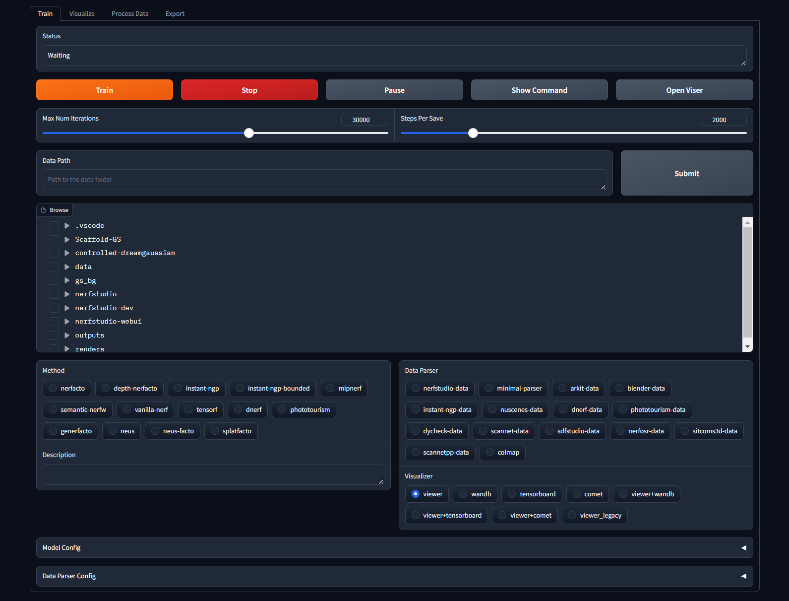

# Nerfstudio Gradio WebUI



## Introduction

This repository provides a user-friendly web interface for [Nerfstudio](https://github.com/nerfstudio-project/nerfstudio) using the [Gradio](https://gradio.app/) library. The Nerfstudio Gradio WebUI allows users to easily train, visualize, process data, and export models without the need for complex command-line interactions.

## Features

- **Training**: Train Nerfstudio models directly from the web interface by selecting the dataset path and corresponding data parser.
- **Visualization**: Visualize trained models with Viser.
- **Data Processing**: Process training data by selecting the dataset path, output path, and processing method.
- **Model Export**: Export trained models by selecting the model configuration and output path.

## Installation

1. Ensure that you have Nerfstudio installed and set up properly.

2. Install the required dependencies by running the following command in the Nerfstudio environment:

   ```bash
   pip install gradio
   ```

3. Clone this repository.

## Usage

1. Start the Nerfstudio Gradio WebUI by running the following command:

   ```bash
   python webui.py
   ```

2. Open a web browser and navigate to `http://localhost:7860` to access the WebUI.

3. Use the different tabs in the WebUI to perform various tasks:

   - **Training**: Select the dataset path and corresponding data parser, then click the "Train" button to start training. Monitor the training progress in the terminal.

   - **Visualization**: Choose the "Visualize" tab, select the configuration file for the trained model, and click the "Visualize" button to launch the Viser tool.

   - **Data Processing**: Choose the "Process Data" tab, select the dataset path, output path, and processing method. Click the "Submit" button to create a new folder if the output path doesn't exist. Then, click the "Process" button to start processing the data.

   - **Model Export**: Choose the "Export" tab, select the configuration file for the trained model and the output path. Click the "Export" button to start exporting the model.

4. Explore the different functionalities provided by the WebUI and enjoy a seamless experience with Nerfstudio!

## Contributing

Contributions to the Nerfstudio Gradio WebUI are welcome! If you encounter any issues or have suggestions for improvements, please open an issue or submit a pull request on the GitHub repository.

## Acknowledgments

- [Nerfstudio](https://github.com/nerfstudio-project/nerfstudio) - The main repository for Nerfstudio.
- [Gradio](https://gradio.app/) - The library used for building the web interface.
